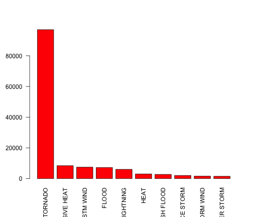
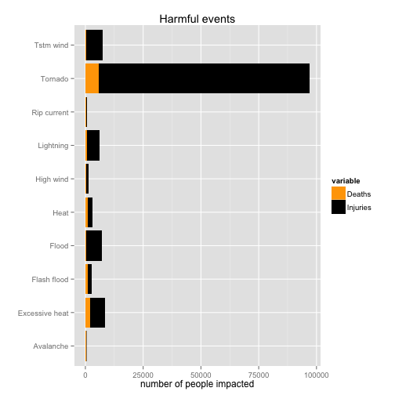
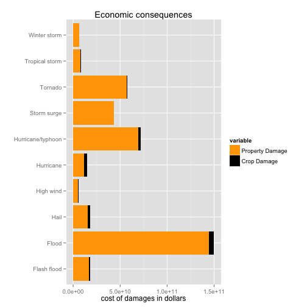

## Impact of Natural-Calamities on the Economy ##

### Synopsis ###
Storms, Tornadoes and several other Natural-Calamities cause public-health-safety and economic problems, for communities and municipalities. 

Many of these calamities result in fatalities, injuries, and property damage.

Preventing these calamities to the extent possible is a key concern.

This report downloads data from NOAA Storm Database and performs a statistical analysis on the impact of physical events to population health and economy.

Examining the event-types, it is observed that most of the physical phenomena cause injuries to people, which sometimes are fatal.

Analysing the event-types and their impact on the economy, we observe that these events caused $15 billions damage to property, in the last 60 years.

By far, Tornadoes are the most dangerous of these events, caused ~100.000 injuries on the last 60 years.



### Data Processing ###

### Load / Storing: stormdata ###

- Data is downloaded from:
https://d396qusza40orc.cloudfront.net/repdata%2Fdata%2FStormData.csv.bz2
- It exists in zipped-format. 
- It is downloaded and un-zipped it is stored in a data-frame stormdata

```r
fileUrl <- "https://d396qusza40orc.cloudfront.net/repdata%2Fdata%2FStormData.csv.bz2"
download.file(fileUrl, destfile = "tempdata.csv.bz2", method = "curl")
stormdata <- read.csv("./tempdata.csv.bz2")
```

### Process ###

The Data is then processed and analyzed to:
- Calculate injuries to humans: "damages" dataframe is used to aggregate both fatal and non-fatal injuries.
- Assess the economic impact by calculating the exponential value of the property and corp damage in data frame "economic".
- Two smaller data frames, "dam" and "eco"", are created to calculate the top 10 events in human and economic impact.

### Loading required packages and creating required subsets ###
```r
library(Hmisc)
library(reshape)
library(ggplot2)
library(car)

stormdata$EVTYPE <- capitalize(tolower(stormdata$EVTYPE))

damages <- aggregate(cbind(FATALITIES, INJURIES) ~ EVTYPE, stormdata, sum)
dam <- melt(head(damages[order(-damages$FATALITIES, -damages$INJURIES), ], 10))

stormdata$PROPDMG <- stormdata$PROPDMG * as.numeric(Recode(stormdata$PROPDMGEXP, 
    "'0'=1;'1'=10;'2'=100;'3'=1000;'4'=10000;'5'=100000;'6'=1000000;'7'=10000000;'8'=100000000;'B'=1000000000;'h'=100;'H'=100;'K'=1000;'m'=1000000;'M'=1000000;'-'=0;'?'=0;'+'=0", 
    as.factor.result = FALSE))
stormdata$CROPDMG <- stormdata$CROPDMG * as.numeric(Recode(stormdata$CROPDMGEXP, 
    "'0'=1;'2'=100;'B'=1000000000;'k'=1000;'K'=1000;'m'=1000000;'M'=1000000;''=0;'?'=0", 
    as.factor.result = FALSE))

economic <- aggregate(cbind(PROPDMG, CROPDMG) ~ EVTYPE, stormdata, sum)
eco <- melt(head(economic[order(-economic$PROPDMG, -economic$CROPDMG), ], 10))
```

### Results ###

### Human casualties ###
### Question: ###
#### Across the United States, which types of events (as indicated in the EVTYPE variable) are most harmful with respect to population health?

Using the ggplot2 library, a combined flipped barplot graph of the fatal (Deaths) and non-fatal Injuries, by event type - is created.

```r
ggplot(dam, aes(x = EVTYPE, y = value, fill = variable)) + geom_bar(stat = "identity") + 
    coord_flip() + ggtitle("Harmful events") + labs(x = "", y = "number of people impacted") + 
    scale_fill_manual(values = c("orange", "black"), labels = c("Deaths", "Injuries"))
```

 


### Economic impact ###
### Question: ###
#### Across the United States, which types of events have the greatest economic consequences?

Using the ggplot2 library a flipped barplot graph of the property and crop damages, by event type - is created.


```r
ggplot(eco, aes(x = EVTYPE, y = value, fill = variable)) + geom_bar(stat = "identity") + 
    coord_flip() + ggtitle("Economic consequences") + labs(x = "", y = "cost of damages in dollars") + 
    scale_fill_manual(values = c("orange", "black"), labels = c("Property Damage", 
        "Crop Damage"))
```

 
